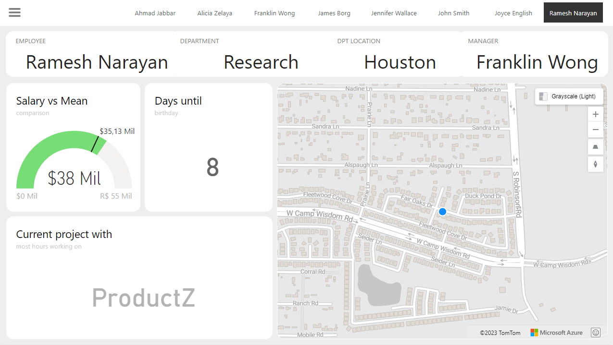

<a name="readme-top"></a>
<div align="center">
  
  [![Contributors][contributors-shield]][contributors-url]
  [![Forks][forks-shield]][forks-url]
  [![Stargazers][stars-shield]][stars-url]
  [![Issues][issues-shield]][issues-url]
  [![MIT License][license-shield]][license-url]
  [![LinkedIn][linkedin-shield]][linkedin-url]

</div>
<br />
<div align="center">
  <a href="https://github.com/voaneves/azure_company_analysis">
    
  </a>
  <h3 align="center">azure_company_analysis</h3>
  <p align="center">
    A complete financial analysis on PowerBI.
    <br />
    <a href="https://github.com/voaneves/azure_company_analysis"><strong>Explore the documentation »</strong></a>
    <br />
    <br />
    <a href="https://github.com/voaneves/azure_company_analysis/issues">Report a Bug</a>
    ·
    <a href="https://github.com/voaneves/azure_company_analysis/issues">Request a Feature</a>
  </p>
</div>

<details>
  <summary>Table of Contents</summary>
  <ol>
    <li>
      <a href="#about-the-project">About the Project</a>
      <ul>
        <li><a href="#technologies-used">Technologies Used</a></li>
      </ul>
    </li>
    <li><a href="#project-structure">Features</a></li>
    <li><a href="#methodology">Features</a></li>
    <li><a href="#challenges-and-solutions">Features</a></li>
    <li><a href="#results">Features</a></li>
    <li><a href="#getting-started">Getting started</a></li>
    <li><a href="#to-do">To Do</a></li>
    <li><a href="#reporting-bugs">Reporting Bugs</a></li>
    <li><a href="#license">License</a></li>
  </ol>
</details>

## About the project

<p align="center">
  <a href="https://voaneves.com/azure_company_analysis">
    
  </a>
</p>

This repository offers an in-depth analysis of a company's data, which is hosted on Azure's MySQL database and visualized using PowerBI.

The primary objective of this project is to seamlessly execute the following operations:

- [X] Create the database schema.
- [X] Extract relevant data.
- [X] Transform this data for analytical purposes.
- [X] Visualize the transformed data using PowerBI.

Key points to pay attention to:
- **Structured Design**: The layout is systematically organized for easy navigation and interpretation.
- **Navigational Aids**: Interactive buttons are incorporated to enhance user navigation within the PowerBI dashboard.
- **Dynamic Slicers and Image Buttons**: Utilized slicers along with associated image buttons for a more interactive and intuitive filtering experience.
- **Visual Switching**: Implemented indicators and buttons to toggle between different visual representations of the same dataset.

<p align="right">(<a href="#readme-top">back to top</a>)</p>

### Technologies Used

The project uses the following technologies:

- Azure: Microsoft Azure is a cloud computing platform offering a range of services like computing power, storage options, and networking capabilities. It allows businesses to run their applications, store data, and perform analytics in a secure and scalable environment.

- MySQL: A widely-used open-source relational database management system that is not exclusive to Microsoft. It is known for its speed, reliability, and ease of use. While it is often used in conjunction with Azure, it is not provided by Microsoft on the Power BI website.

- PowerBI Desktop: A powerful business analytics tool by Microsoft that allows you to visualize your data and share insights across your organization, or embed them in an app or website. It offers a desktop-based interface for creating reports and dashboards. While the desktop version is free to use, online publishing and sharing of reports are features available only to Power BI Pro users.

<p align="right">(<a href="#readme-top">back to top</a>)</p>

## Project Structure

- Folder 1: Processando e Transformando Dados com Power BI
  - Azure Company Analysis @voaneves.pbix
  - Desafio de Projeto - Processando e Transformando Dados com Power BI - Instruções.docx
- LICENSE
- README.md

## Methodology

### Data Preparation

Data Import: The data was imported into Power BI from an open dataset provided by Microsoft on the official Power BI website.

### Initial Setup

1. Metric Definition: Metrics such as Gross Revenue, Discounts, Net Revenue, COGS, and Profit were defined for analysis.
2. Slicer Configuration: Added slicers for MTD (Month-to-Date) and YTD (Year-to-Date) to allow for more precise time-based analysis.

### Development of the First Page (Overview)

3. Grouped Columns and Line Chart: A chart showing operating profit over time was created, grouped by month.
4. Stacked Bar Chart: This chart was used to display gross revenue by product and country.
5. Revenue Map: A map was implemented to visualize the distribution of revenue among different countries.

### Development of the Second Page (Profit Analysis)

6. Hierarchical Tree: Used for a detailed analysis of profit by category.
7. Radar Chart: Implemented to show total profit by product.
8. Treemap: Used to visualize the percentage of profit by country.
9. Funnel: Created to display the percentage of profit by discount band.
10. Stacked Bar Charts: Used to show the percentage of profit by segment.

### Publication and Sharing

11. Final Verification: Before publishing, all visuals were checked to ensure data accuracy.
12. Publication on Power BI Service: The report was then published on Power BI Service for easier access and sharing.

## Challenges and Solutions

### Challenge 1: Temporal Data Aggregation

- Problem: During the creation of the "Operating profit over time by month" chart, we faced difficulties in the correct aggregation of temporal data.
- Solution: We used advanced DAX functions to create a date table that aided in the precise aggregation of data by month.

### Challenge 2: Geographic Visualization

- Problem: The map initially was not displaying the distribution of revenue among countries clearly.
- Solution: Adjustments were made in the map settings and input data to improve clarity and accuracy of the visualization.

### Challenge 3: Performance

- Problem: The report was slow to load, especially the hierarchical tree on the "Profit Analysis" page.
- Solution: We optimized queries and used data modeling techniques to improve report performance.

### Challenge 4: Visualization Consistency

- Problem: Maintaining a consistent appearance between different types of charts and report pages.
- Solution: We established a set of style guidelines and applied them consistently across all visualizations.

### Challenge 5: Report Publication

- Problem: Initial difficulties in publishing the report on Power BI Service, including compatibility and authentication issues.
- Solution: We updated to the latest version of Power BI Desktop and followed troubleshooting procedures to resolve authentication issues.

## Results

1. The report revealed that the operating profit is higher in Channel Partners, both YTD and MTD.
2. The analysis by product and country indicated that Paseo is the most popular product in all countries where sales occur.

### Profit Analysis

1. The hierarchical tree chart showed that France significantly contributes to the overall profit, suggesting that more investments could be directed to this area.
2. The radar chart showed that the Paseo product performs well on multiple indicators, making it an ideal candidate for promotions or market expansion.

### Geographic Analysis

1. The revenue distribution map showed that North America is the largest contributor to revenue, while markets in Europe are still underexplored.

### Efficiency and Usability

1. The report was optimized for quick loading, making it efficient and more user-friendly.
2. The MTD and YTD slicers allow for easy and effective temporal analysis, offering users the flexibility to customize their views.

## Attachments

- [PowerBI Service](https://app.powerbi.com/groups/me/reports/c0543c7a-d391-4474-9fa8-99966ef98170/ReportSection?experience=power-bi)
- [GitHub PBIX File](https://github.com/voaneves/azure_company_analysis/blob/main/Criando%20um%20Relat%C3%B3rio%20de%20Vendas%20Elegante%20com%20Power%20BI/Financial%20Sample%20Analysis%20%40voaneves.pbix)

<p align="right">(<a href="#readme-top">back to top</a>)</p>

## Getting started

1. Clone this repository to your machine:

   ```bash
   git clone https://github.com/your-username/azure_company_analysis.git

   ```

2. Open the index.html file in a web browser.

3. Use the mouse to select colors while moving it.

4. If you click on the selected color, a sliding notification will appear and show which color you selected and copy it to the clipboard.

<p align="right">(<a href="#readme-top">back to top</a>)</p>

## To do

- [ ] Add more pages;
- [ ] Better design the report structure and make the "toggle button" more functional.

<p align="right">(<a href="#readme-top">back to top</a>)</p>

## Reporting bugs

Found a bug or issue in the project? Follow the steps below:

1. Check if the bug has already been reported in our "Issues" section on GitHub: link to Issues.

2. If you don't find an existing report about the bug, click on "New Issue" to open a new bug report.

3. Provide a clear and descriptive title for the bug, along with a detailed description of the steps needed to reproduce it.

4. If possible, include screenshots, relevant code snippets, or any other information that may help identify and resolve the bug.

5. Click on "Submit Issue" to create the bug report.

Thank you for reporting bugs! If you would like to contribute with code, you can open a PR, and your participation is more than welcome.

<p align="right">(<a href="#readme-top">back to top</a>)</p>

## License

This project is licensed under the [MIT License](/LICENSE).

<p align="right">(<a href="#readme-top">back to top</a>)</p>

[contributors-shield]: https://img.shields.io/github/contributors/voaneves/azure_company_analysis.svg?style=for-the-badge
[contributors-url]: https://github.com/voaneves/azure_company_analysis/graphs/contributors
[forks-shield]: https://img.shields.io/github/forks/voaneves/azure_company_analysis.svg?style=for-the-badge
[forks-url]: https://github.com/voaneves/azure_company_analysis/network/members
[stars-shield]: https://img.shields.io/github/stars/voaneves/azure_company_analysis.svg?style=for-the-badge
[stars-url]: https://github.com/voaneves.com/azure_company_analysis/stargazers
[issues-shield]: https://img.shields.io/github/issues/voaneves/azure_company_analysis.svg?style=for-the-badge
[issues-url]: https://github.com/voaneves/azure_company_analysis/issues
[license-shield]: https://img.shields.io/github/license/voaneves/azure_company_analysis.svg?style=for-the-badge
[license-url]: https://github.com/voaneves/azure_company_analysis/blob/main/LICENSE
[linkedin-shield]: https://img.shields.io/badge/-LinkedIn-black.svg?style=for-the-badge&logo=linkedin&colorB=555
[linkedin-url]: https://linkedin.com/in/voaneves
[azure_company_analysis-logo]: img/azure_company_analysis-logo.png


## Getting started

First, let's create the database itself. We'll temporarily name it test_company and then rename it to 

```SQL
-- Create the database called azure_company
CREATE DATABASE azure_company;
```

Now, let's create the tables required for our schema.

### Create table EMPLOYEE

Here, we create an EMPLOYEE table to store information about each employee in the company.

```SQL 
Create table EMPLOYEE
(Fname VARCHAR(15) NOT NULL,
 Minit CHAR,
Lname VARCHAR(15) NOT NULL,
Ssn CHAR(9) NOT NULL,
Bdate DATE,
Address VARCHAR(30),
Sex CHAR,
Salary DECIMAL(10,2),
Super_ssn CHAR(9),
Dno INT NOT NULL,
PRIMARY KEY (Ssn) );
```

### Create table DEPARTMENT

This table stores information about the various departments within the company.

```SQL
Create table DEPARTMENT
(Dname VARCHAR(15) NOT NULL, 
Dnumber INT NOT NULL,
Mgr_ssn CHAR(9) NOT NULL,
Mgr_start_date DATE,
PRIMARY KEY(Dnumber),
UNIQUE(Dname),
FOREIGN KEY(Mgr_ssn)REFERENCES EMPLOYEE(Ssn) );
```

### Create table DEPT_LOCATIONS

A department can have multiple locations, which is what this table represents.

```SQL
Create table DEPT_LOCATIONS
( Dnumber INT NOT NULL,
Dlocation VARCHAR(15) NOT NULL,
PRIMARY KEY(Dnumber, Dlocation),
FOREIGN KEY(Dnumber) REFERENCES DEPARTMENT(Dnumber) );
```

### Create table PROJECT

This table contains details about the projects undertaken by the company.

```SQL
Create table PROJECT
( Pname VARCHAR(15) NOT NULL,
Pnumber INT NOT NULL,
Plocation VARCHAR(15),
Dnum INT NOT NULL,
PRIMARY KEY (Pnumber),
UNIQUE (Pname),
FOREIGN KEY(Dnum) REFERENCES DEPARTMENT(Dnumber) );
```

### Create table WORKS_ON

This table links employees with the projects they are working on.

```SQL
Create table WORKS_ON
( Essn CHAR(9) NOT NULL,
Pno INT NOT NULL,
Hours DECIMAL(3,1) NOT NULL,
PRIMARY KEY(Essn, Pno),
FOREIGN KEY(Essn) REFERENCES EMPLOYEE(Ssn),
FOREIGN KEY (Pno) REFERENCES PROJECT(Pnumber) );
```

### Create table DEPENDENT

To create the **DEPENDENT** table, execute:

```SQL
Create table DEPENDENT
( Essn CHAR(9) NOT NULL,
Dependent_name VARCHAR(15) NOT NULL,
Sex CHAR,
Bdate DATE,
Relationship VARCHAR(8),
PRIMARY KEY(Essn, Dependent_name),
FOREIGN KEY(Essn) REFERENCES EMPLOYEE(Ssn) );
```

Now, let's execute the SQL commands to populate the tables. 

### Insert Values into employee

```SQL
insert into employee values ("John","B","Smith",123456789,"1970-06-20","Houston","M",30000,333445555,5);
insert into employee values ("Franklin","T","Wong",333445555,"1955-12-08","638 Voss, Houston TX","M",40000,888665555,5);
insert into employee values ("Alicia","J","Zelaya",999887777,"1968-01-19","3321 Castle, Spring TX","F",25000,987654321,4);
insert into employee values ("Jennifer","S","Wallace",987654321,"1941-06-20","291 Berry, Bellaire, TX","F",43000,888665555,4);
insert into employee values ("Ahmad","V","Jabbar",987987987,"1969-03-29","980 Dallas, Houston, TX","M",25000,987654321,4);
insert into employee values ("James","E","Borg",888665555,"1937-11-10","450 Stone, Houston, TX","M",55000,NULL,1);
insert into employee values ("Ramesh","K","Narayan",666884444,"1962-09-15","975 Fire Oak, Humble, TX","M",38000,333445555,5);
insert into employee values ("Joyce","A","English",453453453,"1972-07-31","5631 Rice, Houston, TX","F",25000,333445555,5);
```

### Insert Values into department

```SQL
insert into department values ("Research",5,333445555,"1988-05-22");
insert into department values ("Administration",4,987654321,"1995-01-01");
insert into department values ("Headquarters",1,888665555,"1981-06-19");
```

### Insert Values into dept_locations

```SQL
insert into dept_locations values(1,"Houston");
insert into dept_locations values(4,"Stafford");
insert into dept_locations values(5,"Bellaire");
insert into dept_locations values(5,"Sugarland");
insert into dept_locations values(5,"Houston");
```

### Insert Values into PROJECT

```SQL
insert into PROJECT values("ProductX",1,"Bellaire",5);
insert into PROJECT values("ProductY",2,"Sugarland",5);
insert into PROJECT values("ProductZ",3,"Houston",5);
insert into PROJECT values("Computerization",10,"Stafford",4);
insert into PROJECT values("Reorganization",20,"Houston",1);
insert into PROJECT values("Newbenefits",30,"Stafford",4);
```

### Insert Values into WORKS_ON

```SQL
insert into WORKS_ON values(123456789,1,32.5);
insert into WORKS_ON values(123456789,2,7.5);
insert into WORKS_ON values(666884444,3,40);
insert into WORKS_ON values(453453453,1,20);
insert into WORKS_ON values(453453453,2,20);
insert into WORKS_ON values(333445555,2,10);
insert into WORKS_ON values(333445555,3,10);
insert into WORKS_ON values(333445555,10,10);
insert into WORKS_ON values(333445555,20,10);
insert into WORKS_ON values(999887777,30,30);
insert into WORKS_ON values(999887777,10,10);
insert into WORKS_ON values(987987987,10,35);
insert into WORKS_ON values(987987987,30,5);
```

### Add FOREIGN KEY (DNO) to EMPLOYEE

Finally, add the foreign key constraint for the Dno attribute in the EMPLOYEE table:

```SQL
ALTER TABLE EMPLOYEE ADD CONSTRAINT FOREIGN KEY (DNO) REFERENCES DEPARTMENT(DNUMBER);
```


### Queries used

This section provides a collection of SQL queries commonly used in the azure_company project. Each query is enclosed in a dropdown for easy navigation.

<details>
<summary> Q1.retrieve the Salary of every employee </summary>
  
```SQL
select salary from employee;
```
</details>

---

<details>
<summary> Q2.retrieve all distinct Salary values </summary>
  
```SQL
select distinct salary from employee;
```
</details>

---

<details>
<summary> Q3.retrieve the birth date and address of the employee(s) whose name is "John" </summary>
  
```SQL
select Bdate , address from employee where Fname = "john";
```
</details>

---

<details>
<summary> Q4.For each employee, retrieve the employee’s first and last name and the first and last name of his or her immediate supervisor </summary>
  
```SQL
select E.fname as "employee first name" , E.lname as "employee last name" , S.fname as "manager first name", S.lname as "manager last name"
from employee as E , employee as S
where E.Super_ssn = S.ssn;
```
</details>

 ---

<details>
<summary> Q5.retrieve all info of employees who work in department 5 </summary>
  
```SQL
select * from employee where Dno = 5;
```
</details>

---

<details>
<summary> Q6.retrieve all info of employees whose addresses contains Houston </summary>
  
```SQL
select * from employee where address like '%Houston%';
```
</details>

---

<details>
<summary> Q7.retrieve all info of employees whose salaries between 40000 and 30000 </summary>
  
```SQL
select * from employee where Salary between 30000 and 40000;
```
</details>

---

<details>
<summary> Q8.retrieve first name of all employees ordered alphabetically  </summary>
  
```SQL
select fname from employee order by Fname asc;
```
</details>

---

<details>
<summary> Q9.retrieve names of all employees who do not have supervisor </summary>
  
```SQL
select fname from employee where Super_ssn is null;

```
</details>

---

<details>
<summary> Q10.retrieve name of every employee whose Salary is greater than all the salaries of employees in department 5 </summary>
  
```SQL
select fname ,Salary
from employee 
where salary > All ( select salary 
                     from employee
                     where dno = 5
                          ) ;
```
</details>

---

<details>
<summary> Q11.max , min , avg , sum ,count </summary>
  
```SQL
SELECT SUM(Salary), MAX(Salary), MIN(Salary), AVG(Salary) , count(salary)
FROM	EMPLOYEE;
```
</details>

---

<details>
<summary> Q12.select the Essns of all employees who work the same (project, hours) combination on some project 
that employee ‘John Smith’ (whose Ssn = ‘123456789’) works on  </summary>
  
```SQL
select distinct Essn 
from works_on where (pno , hours) in ( select pno , hours
                         from works_on
                         where Essn = "123456789"
                         );
```
</details>

---

## PowerBI Actions and Analysis

This section outlines the series of actions performed in PowerBI to clean, transform, and analyze the data from the azure_company database. Each step is crucial for ensuring data integrity and for preparing the data for meaningful analysis.

### Data Preparation Steps

1. **Check Headers and Data Types**: Verify the headers and data types of each column in the data set.
   
2. **Modify Monetary Values**: Convert all monetary values to double precision type.

3. **Null Value Analysis**: Check for the existence of null values and consider their removal.

4. **Identify Managers**: Employees with null values in the `Super_ssn` field may be managers. Validate if there are any employees without a manager.

5. **Check for Departments Without Managers**: Verify if there are any departments without a designated manager.

6. **Fill in Missing Manager Information**: If there are departments without managers, assume you have the necessary data and fill in the gaps.

### Data Transformation Steps

7. **Examine Project Hours**: Review the number of hours allocated to each project.

8. **Split Complex Columns**: Divide columns containing multiple types of information.

9. **Merge Employee and Department Queries**: Create a new table by merging the `employee` and `department` tables, focusing on the `employee` table as the base. The type of join will depend on the specific requirements.

10. **Remove Unnecessary Columns**: Eliminate columns that are not essential for further analysis.

11. **Join Employees and Manager Names**: This can be done either using SQL queries or by merging tables in PowerBI. If SQL is used, specify the query in the README.

12. **Merge First and Last Names**: Combine the first and last names into a single column to represent each employee's full name.

13. **Merge Department Names and Locations**: Combine the names of departments with their locations to create unique department-location combinations. This will be useful for creating a star schema in future modules.

14. **Explanation for Merging vs. Assigning**: Explain why, in this specific case, merging is preferable to assigning.

### Data Analysis Steps

15. **Group Data by Manager**: Aggregate the data to find out how many employees are managed by each manager.

16. **Remove Further Unnecessary Columns**: Delete columns that will not be used in the final report.

### Measures

17. Department Location of biggest project and it's characteristics
```DAX
Department Location of biggest project = IF(ISBLANK(MAXX (
    FILTER ( 'company project', 'company project'[Pnumber] = [Most hours project number] ),
    'company project'[Plocation]
)), "Headquarters", MAXX (
    FILTER ( 'company project', 'company project'[Pnumber] = [Most hours project number] ),
    'company project'[Plocation]
))

Most hours project name = IF(ISBLANK(MAXX (
    FILTER ( 'company project', 'company project'[Pnumber] = [Most hours project number] ),
    'company project'[Pname]
)), "Management", MAXX (
    FILTER ( 'company project', 'company project'[Pnumber] = [Most hours project number] ),
    'company project'[Pname]
))

Max Number of Hours Project = CALCULATE ( IF ( ISFILTERED ( 'Employee-Ssn'[FLname] ), MAX( 'company works_on'[Hours] ), "None" ))

Most hours project number = MAXX (
    FILTER ( 'company works_on', 'company works_on'[Hours] = [Max Number of Hours Project] ),
    'company works_on'[Pno]
)
```

18. Selected Employee and it's characteristics
```DAX 
Selected Employee = CALCULATE ( IF ( ISFILTERED ( 'Employee-Ssn'[FLname] ), SELECTEDVALUE( 'Employee-Ssn'[FLname] ), "None" ))

Selected Department = CALCULATE ( IF ( ISFILTERED ( 'Employee-Ssn'[FLname] ), FIRSTNONBLANK('employee+dp+mgr'[Department], 1), "None" ))

Selected Manager = CALCULATE ( IF ( ISFILTERED ( 'Employee-Ssn'[FLname] ), IF(ISBLANK(FIRSTNONBLANK('employee+dp+mgr'[Manager], 1)), "None", FIRSTNONBLANK('employee+dp+mgr'[Manager], 1)), "None" ))

Selected Address = CALCULATE ( IF ( ISFILTERED ( 'Employee-Ssn'[FLname] ), FIRSTNONBLANK('Mescla Employee-Department'[Address], 1), "None" ))

Selected Salary = CALCULATE ( IF ( ISFILTERED ( 'Employee-Ssn'[FLname] ), FIRSTNONBLANK('Mescla Employee-Department'[Salary], 1), "None" ))
```

19. Days until birtday
```DAX
Days until Bday = IF(
    DATEDIFF (
        TODAY (),
        DATE ( YEAR ( TODAY () ), MONTH ( FIRSTNONBLANK('Mescla Employee-Department'[Bdate], 1 )), DAY ( FIRSTNONBLANK('Mescla Employee-Department'[Bdate], 1 )) ),
        DAY
    ) < 0, "Next year...", IF( DATEDIFF (
        TODAY (),
        DATE ( YEAR ( TODAY () ), MONTH ( FIRSTNONBLANK('Mescla Employee-Department'[Bdate], 1 )), DAY ( FIRSTNONBLANK('Mescla Employee-Department'[Bdate], 1 )) ),
        DAY
    ) = 0, "Today", DATEDIFF (
        TODAY (),
        DATE ( YEAR ( TODAY () ), MONTH ( FIRSTNONBLANK('Mescla Employee-Department'[Bdate], 1 )), DAY ( FIRSTNONBLANK('Mescla Employee-Department'[Bdate], 1 )) ),
        DAY
    )
    ))
```

20. Salary gauge vs mean
```DAX
Color = IF([Selected Salary]>[Mean Salary],"#77DD77","#FF6961")

Max Salary = CALCULATE(
    MAX('Mescla Employee-Department'[Salary]),
    ALLEXCEPT('Mescla Employee-Department', 'Mescla Employee-Department'[Salary])
)

Mean Salary = CALCULATE(
    AVERAGE('Mescla Employee-Department'[Salary]),
    ALLEXCEPT('Mescla Employee-Department', 'Mescla Employee-Department'[Salary])
)

Min Salary = CALCULATE(
    MIN('Mescla Employee-Department'[Salary]),
    ALLEXCEPT('Mescla Employee-Department', 'Mescla Employee-Department'[Salary])
)
```
